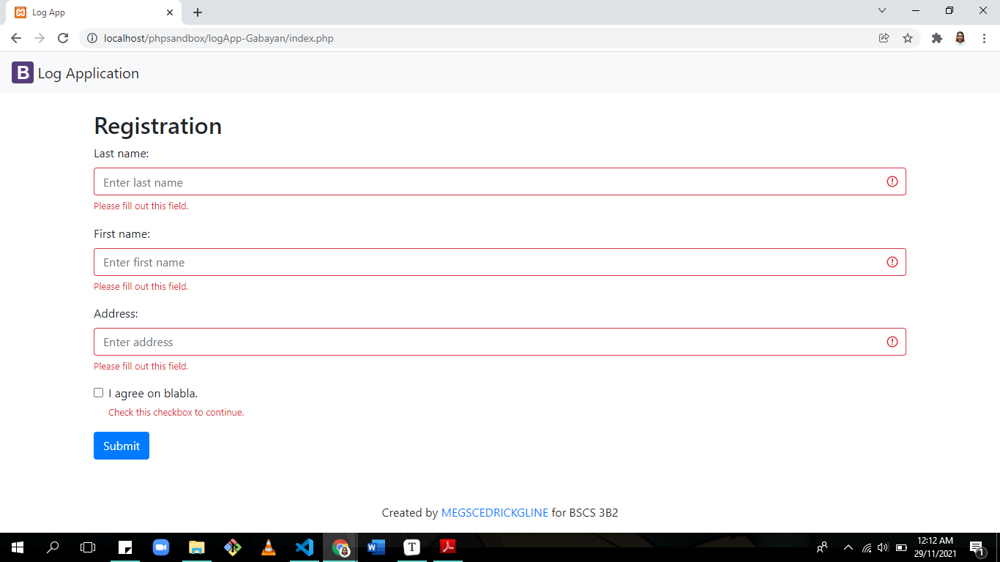
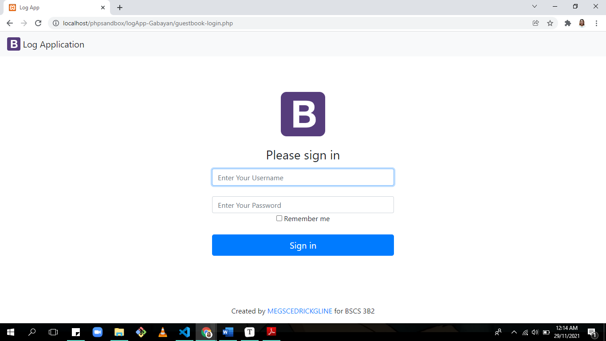
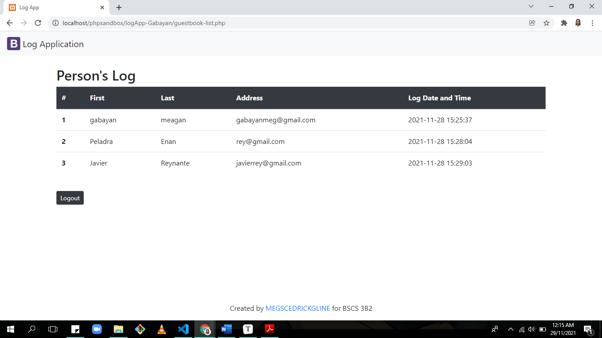

# Log App

#### During this pandemic, we encounter logbooks in any establisments before entering their premises. This LogApp will help collect individual's information such as their *Last name*, *First name*, and  *Address*, also the date and time he/she visited a certain place is recorded. Only users with an admin account can check the list of individuals who visited the place.

#### This includes:
- Registration
- Guestbook Log In
- Guestbook List

## Visuals
#### The following are the screenshots of the Log Application.

#### The registration page collects the Last name, First name and Address of an individual.

#### The Log in page can only be access by users with an admin account.

#### After the user with an admin account successfully logged in, he/she will be directed in the guestbook list page and will see the person's log table that includes the names, adress and the log date and time of an individual who submitted their registration.

# Installation

- Download and install Xampp Apache to test and deploy the web app
- Run as administrator the Xampp Control
- Clone the repository https://github.com/MeganRows/logApp-Gabayan.git
- Create an account in https://www.freesqldatabase.com
- After logging in click the "Follow this link for phpMyAdmin"
- Set up your database by creating tables PERSON( uid, lastname, firstname, address, logdt) and USERACCOUNT (uid, username, password) and set the type of logdt to TIMESTAMP and default value to CURRENT_TIMESTAMP
- Edit the logApp source code from the cloned repository
- Open the config.php file and modify the value set for DB_HOST, DB_USER, DB_PASS, DB_NAME
according to your Database details in **freesqldatabase** account.
- Save the logApp source code in Xampp-htdocs-phpsandbox and test if the system functions as expected.
- To test the logApp go to the browser and type *localhost/phpsandbox/logApp-Gabayan/index.php* for the registration page and for the log in page *localhost/phpsandbox/logApp-Gabayan/guestbook-login.php*. when the user click "Sign in", it will direct the user to the guestbook-list page.

# Authors
## Meagan Rose D. Gabayan
### BSCS3-B2

### Github account: https://github.com/MeganRows

